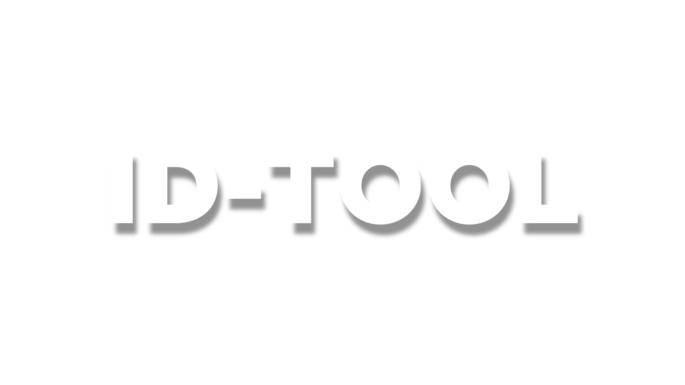

# ID-Tool

A simple but usefull id generator. Can be used to create a custom secret key.




## Authors

- NullOnRise


## FAQ

#### Supports UTF8?

Yes it supports it!

#### Can use a template?

Yes just use:
```
npx create-idtool-template
```


## Examples

Generate ID
```
const idtool = require("id-tool");

//Generate a base64 code with numbers
const output = idtool.IDGen("test", 16)

//Send to console the output
console.log(output);
```

Decode Generated IDs
```
const idtool = require("id-tool");

//Generate a base64 code with numbers
const output = idtool.IDDecode("dGVzdDM2NTI4MDc0NTg4NDEzODI=")

//Send to console the output
console.log(output);
```